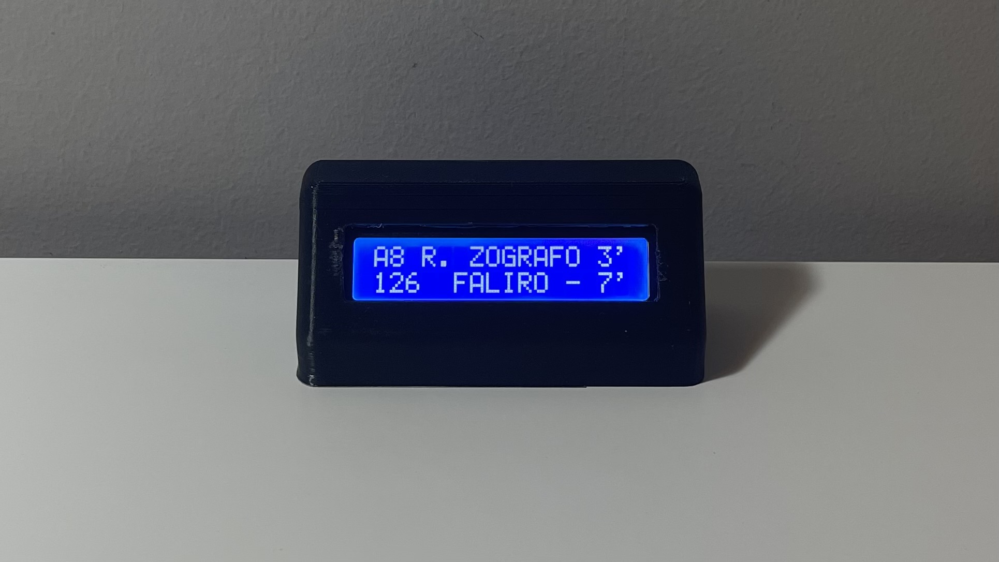

# OASA Realtime

An always on, WiFi-enabled display powered by [ESP32](https://www.sudo.is/docs/esphome/boards/esp32c3supermini/) which shows live bus arrivals for Athens (with many other Greek cities supported in principle).
Forked from [here](https://github.com/h9419/ESP_AP_Webserver.git) and [here](https://www.thingiverse.com/thing:614241).

## Installation and setup

1. Install [VSCode](https://code.visualstudio.com/) or [VSCodium](https://vscodium.com/)
    * Install the [Platform IO extension](https://platformio.org/install/ide?install=vscode)
2. Install [Node.js](https://nodejs.org/en/) for npm and your extension of choice for JavaScript

## Uploading to ESP32

There are two actions required to upload this to your ESP32.

1. Upload the code (Platform IO -> Project Tasks -> esp32dev -> General -> Upload)
2. Upload the React Web App (Platform IO -> Project Tasks -> esp32dev -> Platform -> Upload Filesystem Image)

## Configuration

1. Go to https://oasa.ppdms.gr and follow the instructions to download a JSON file with the stops you are interested in and your WiFi credentials.
2. Power on the ESP and log in to its WiFi AP: you will be redirected to a captive portal where you can upload the JSON. After uploading, the display will start working automatically.

## TODO
1. Add reset button functionality to reupload settings without reflashing (trivial)
2. Add support for other Greek cities which use [this](https://github.com/fotispozoglou/greece-telematics-cli/blob/main/modules/Telematics.py) API